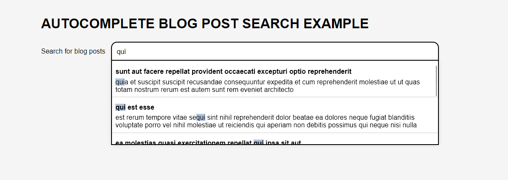

## Autocomplete blog post search example

In this project, one can search for blog posts coming from a placeholder API and get a preview of the search results in a searchbox below the search input.

The project is built using HTML, CSS and JavaScript. I used JavaScript for implementing the API requests, rendering the results and detect scrolling. The results are filtered from the response of the API request and are then rendered to the screen using HTML templates with the search term enclosed by the `mark` element to highlioght the matches. 

With the help of some CSS, the searchbar expands when focused.

WHen focusing the search input, one can also use the up and down keys to navigate through the searchbox preview blog posts. When clicking on a preview blogpost in the searchbox, the post is displayed to the screen.

